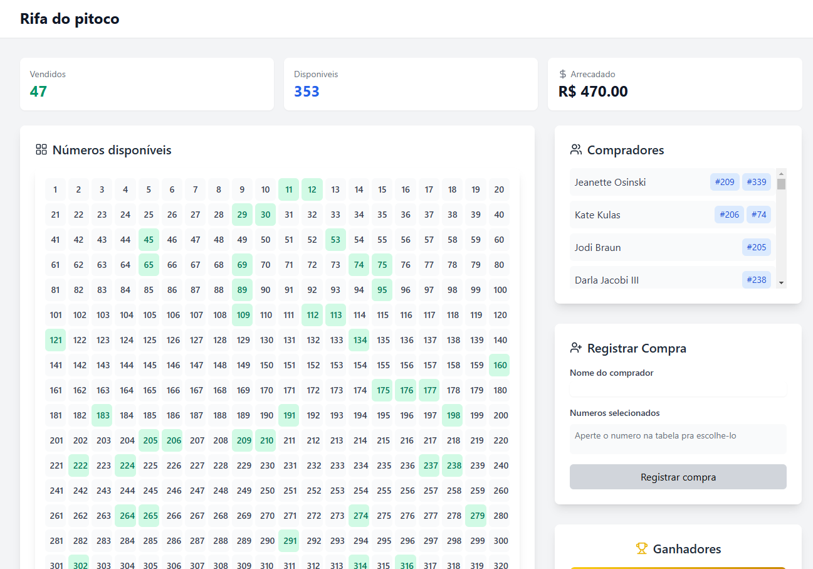
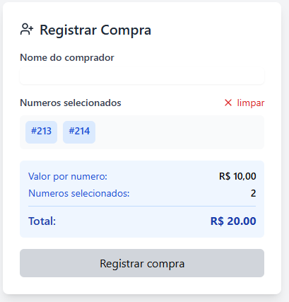

# Sorteio de números

## Tecnologias utilizadas

- Node.js
- Tailwind CSS
- Shadcn/UI
- React Hook Form

## Instruções para execução

1. Clone o repositório
2. Instale as dependências com `npm install`
3. Inicie o servidor com `npm run dev`

## Observações

- O servidor está configurado para rodar na porta 3000.
- O banco de dados está configurado para rodar com prisma a partir do arquivo `prisma/schema.prisma` e sendo salvo no arquivo `dev.db`.
- O servidor do backend deve ser iniciado separadamente, a partir do comando `npm run start`.

# Preview

## Visão geral

## Comprando números

## Ganhadores mais recentes

## Ganhadores anteriores

